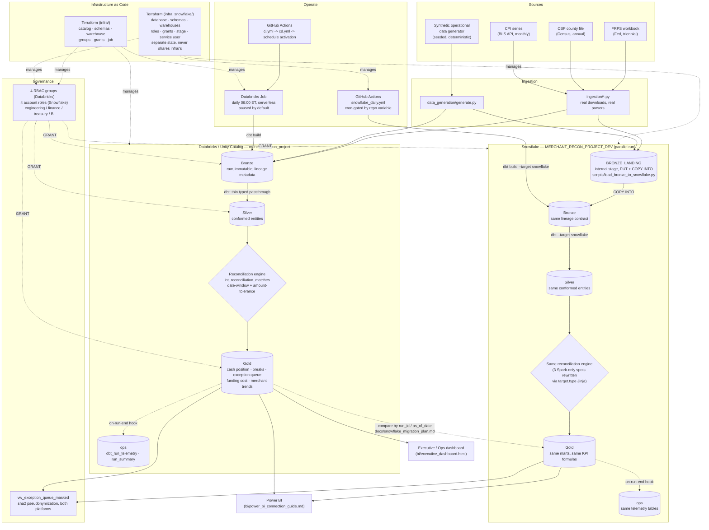

# Architecture

## Data flow

## Why batch, not streaming

Settlement reconciliation is inherently a T+1/T+2 problem: you're reconciling against a bank statement that posts once a day, not a real-time event stream. Batch is the architecturally correct choice for this problem, rather than a default reached for out of habit.

## Layer responsibilities

| Layer | Owns | Materialization |
|---|---|---|
| Bronze | Raw landed data, lineage metadata (`_source_system`, `_ingestion_timestamp`, `_batch_id`, `_row_hash`) | Full-refresh table per run |
| Silver | Conformed entities, typed, 1:1 with a Bronze source (thin passthrough — no business logic) | `table` |
| Silver (engine) | `int_reconciliation_matches` — the only place matching logic lives | `table` |
| Gold | Business-facing marts, KPI-contract-exact formulas | `table` |
| ops | Observability — never business data | `table`, append-only for telemetry |

## Environments

Only `dev` is deployed on Databricks (one live workspace). `infra/environments/prod.tfvars` parameterizes what a second environment would look like (separate catalog, larger warehouse) without provisioning a real duplicate footprint — see [infra/README.md](../infra/README.md).

The Snowflake retarget follows the identical posture: only `dev` (`MERCHANT_RECON_PROJECT_DEV`) is applied, `infra_snowflake/environments/prod.tfvars` is documented-only — see [infra_snowflake/README.md](../infra_snowflake/README.md).

## Snowflake retarget

A full second implementation of this platform on Snowflake runs in parallel with the Databricks one above — see [docs/snowflake_migration_plan.md](snowflake_migration_plan.md) for the migration plan, the non-obvious differences it surfaced (no real Bronze load mechanism existed to "redirect," Spark-only SQL that silently changes meaning on Snowflake, grants that get wiped on table rebuild), and the parallel-run/cutover checklist. `infra/` and `infra_snowflake/` are fully separate Terraform stacks with no shared state, by design.

## Where each phase's output lives

| Phase | Artifact |
|---|---|
| 1 — Business framing | [charter/PROJECT_CHARTER.md](../charter/PROJECT_CHARTER.md), [docs/kpi_contract.md](kpi_contract.md), [docs/non_functional_targets.md](non_functional_targets.md) |
| 2 — Source contracts | [docs/source_contracts/](source_contracts/), [ingestion/](../ingestion/) |
| 3 — Synthetic data | [data_generation/](../data_generation/) |
| 4 — Medallion + reconciliation | [transform/](../transform/) |
| 5 — Data quality/observability | `transform/tests/`, `gold.fct_exception_queue`, `ops.*` |
| 6 — Governance | [docs/rbac_access_matrix.md](rbac_access_matrix.md), [docs/data_governance.md](data_governance.md) |
| 7 — IaC | [infra/](../infra/) |
| 8 — CI/CD | [.github/workflows/](../.github/workflows/), [docs/release_runbook.md](release_runbook.md) |
| 9 — BI + packaging | [bi/](../bi/), this document, [docs/executive_summary.md](executive_summary.md) |
| Snowflake retarget | [infra_snowflake/](../infra_snowflake/), [docs/snowflake_migration_plan.md](snowflake_migration_plan.md), [scripts/load_bronze_to_snowflake.py](../scripts/load_bronze_to_snowflake.py) |
